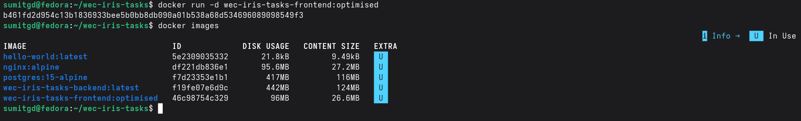
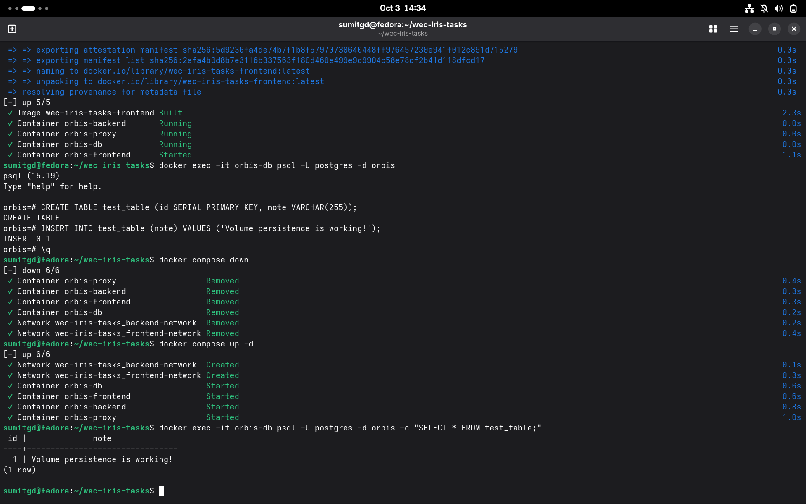
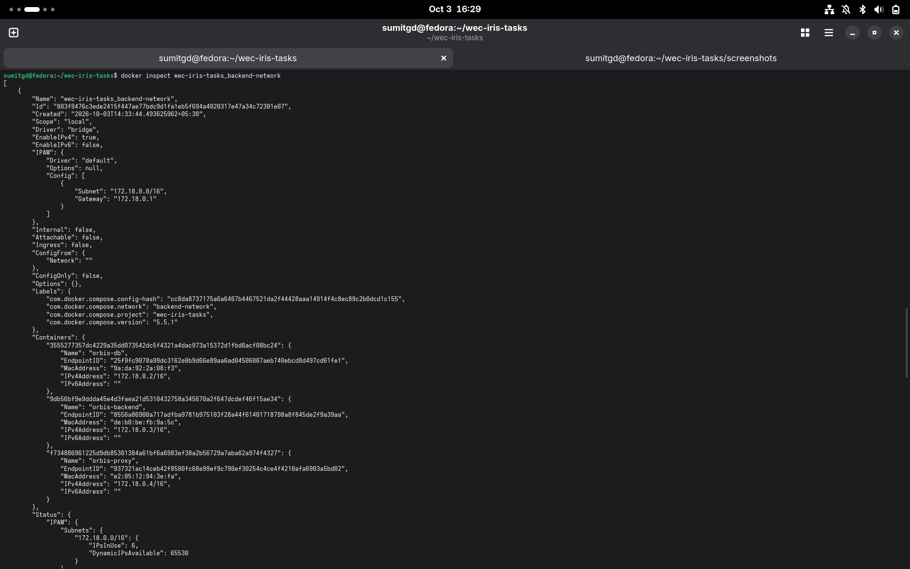
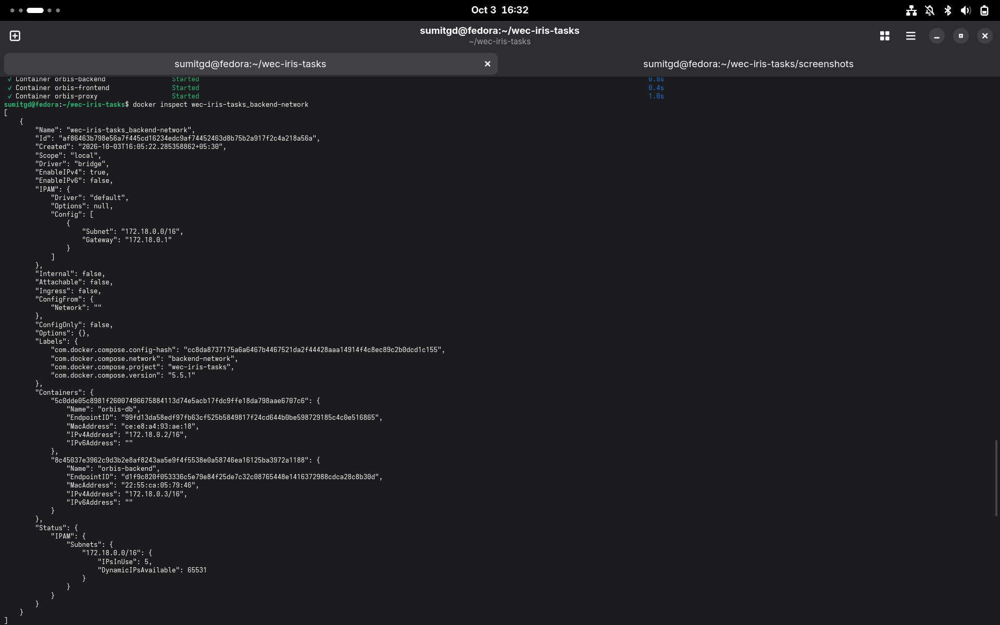
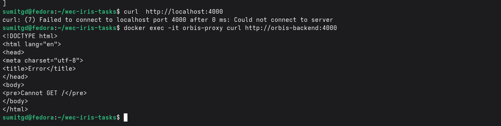
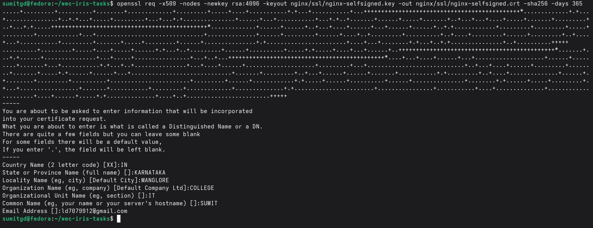
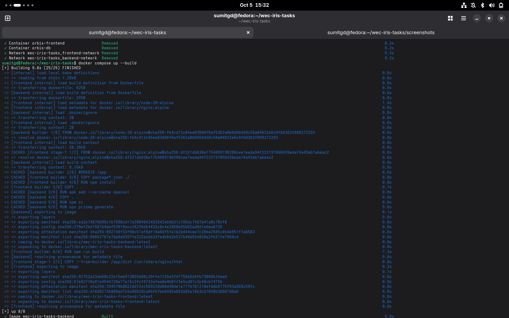
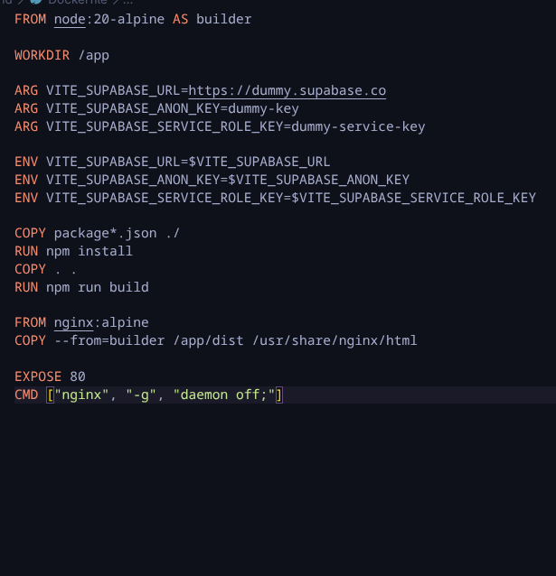

## PHASE 1

### Issue 1

#### Log output 
orbis-backend  | prisma:warn Prisma failed to detect the libssl/openssl version to use, and may not work as expected. Defaulting to "openssl-1.1.x".

orbis-backend  | Please manually install OpenSSL and try installing Prisma again.

orbis-backend  | Database connection attempt 1 failed: PrismaClientInitializationError: Unable to require(`/app/node_modules/.prisma/client/libquery_engine-linux-musl.so.node`).

orbis-backend  | The Prisma engines do not seem to be compatible with your system. Please refer to the documentation about Prisma's system requirements: https://pris.ly/d/system-requirements

orbis-backend  | 
orbis-backend  | Details: Error loading shared library libssl.so.1.1: No such file or directory (needed by /app/node_modules/.prisma/client/libquery_engine-linux-musl.so.node)

### Diagnosis and FIX

**Diagnosis**
	Basically Prisma is used for the translation of JS code to SQL queries. It requires OPENSSL to establish a secure network connections.
	Since the image is built on the alpine versions therefore it is missing the shared library libssl.so.1.1 
**FIX**
	 In the /backend/Dockerfile added
		  RUN apk add --no-cache openssl

### ISSUE 2

#### Log output
prisma:info Starting a postgresql pool with 25 connections.

orbis-frontend  |  INFO  Accepting connections at http://localhost:80

orbis-backend   | Database connection attempt 1 failed: PrismaClientInitializationError: Can't reach database server at `database:5432`

orbis-backend   | 
orbis-backend   | Please make sure your database server is running at `database:5432`.

orbis-backend   |     at t (/app/node_modules/@prisma/client/runtime/library.js:112:2488)

orbis-backend   |     at async connectWithRetry (file:///app/src/config/database.js:20:7) {
orbis-backend   |   clientVersion: '6.0.1',
orbis-backend   |   errorCode: 'P1001'
orbis-backend   | }

#### Diagnosis and Fix

**Diagnosis**
	So the error is that there is a problem in establishing a connection with the database looking into the docker-compose file the database is attached to the backend-network whereas the backernd is attached to the frontend-network only  because it utilises prisma and translates JS code to SQL Queries therefore it also requires to communicate with the backend network
**FIX**
	 In the docker compose file 
	 add in
	backend:
		networks:
			- backend-network

### ISSUE 3 

#### log output
orbis-frontend  |  INFO  Accepting connections at http://localhost:80
#### ISSUE DETAIL
when we click on this url it gives us a blank page, on inspecting the console
Uncaught Error: supabaseUrl is required.

    GB http://localhost/assets/index-CMXlV9Ng.js:119  

    VB http://localhost/assets/index-CMXlV9Ng.js:119  

    <anonymous> http://localhost/assets/index-CMXlV9Ng.js:119
    
#### Diagnosis and FIX
**Diagnosis**
Since our frontend is built on vite, it requires environment variables  like VITE_SUPABASE_URL, to be present at build time.  The Dockerfile in the frontend was executing npm run build without passing any environment variables. Therefore Supabase client tried to initialize with undefined value, thereby crashing React before it could render.

**FIX**
In the frontend/Dockerfile added these:

ARG VITE_SUPABASE_URL=https://dummy.supabase.co
ARG VITE_SUPABASE_ANON_KEY=dummy-key
ARG VITE_SUPABASE_SERVICE_ROLE_KEY=dummy-service-key

ENV VITE_SUPABASE_URL=$VITE_SUPABASE_URL
ENV VITE_SUPABASE_ANON_KEY=$VITE_SUPABASE_ANON_KEY
ENV VITE_SUPABASE_SERVICE_ROLE_KEY=$VITE_SUPABASE_SERVICE_ROLE_KEY

And then in the Dockercompose file added these
args:
	VITE_SUPABASE_URL: "https://dummy.supabase.co"
	VITE_SUPABASE_ANON_KEY: "dummy-key
	VITE_SUPABASE_SERVICE_ROLE_KEY: "dummy-service-key"

## PHASE 2

#### Problem
To optimise the image size of frontend part since the image size is 460MB 
Original size but we need it to be strictly under 110 MB.
./screenshots/p2-original-size.png

#### Diagnosis & Fix
1. The Dockerfile uses heavy node:20 
		Fix: node:20-alpine
				Replaced the heavy standard Node base image with the alpine version
2.  In the original file the COPY . . was placed before the npm install. When we change the source-code it had to reinstall the npm dependencies from the beginning this leads to inefficiency therefore now it is placed after npm install
		 Fix: RUN npm install
			COPY . .
3.  We copy the packag.json before the rest of the source file is copied because we utilise the Docker caching mechanism to build any new dependencies in layers. Since they change less frequently then the source code, if there is any change in the dependencies it safely installs it that specific change, if there is only change in the source code it is left untouched. Therefore we optimise the caching here.
		Fix:   COPY package*.json ./
				Add it before the  npm install mentioned above
4.  Switching to lightweight Nginx server because the Node-based static server because the Node-based static server dragged Node.js runtime in to the container to serve the static files BUT Nginx is lightweight doesnot need Node.js to run
		 Fix: FROM nginx:alpine
				COPY --from=builder /app/dist /usr/share/nginx/html
				EXPOSE 80
				CMD ["nginx", "-g", "daemon off;"]				
				since we changed our server to nginx we have to modify it in CMD also

### RESULT

## PHASE 3
## Diagnosis & Fix
1. 
	Database credentials and backend connection strings were hardcoded directly in docker-compose.yml . This exposes sensitive data if the file is committed to version control.
		 FIX: I created .env file to store DB keys securely. Then connected them to database environment and the backend's URL using ${ } added the .env file to the gitignore file so it cannot be commited and DB remains same.
2.  
	The database must allow internal traffic from the backend container but must block direct access from the host machine to minimize attack surfaces. 
			 FIX: did not include port mapping in DB part because the database and backend share the internal backend-network, omitting  the host port mapping keeps port 5432 entirely isolated from the host OS while still allowing internal container-to-container communication.
	P.S. It was already preseent. 
3.  the volume-part did not require any kind of modification since it was already correct
			volumes:
			 - postgres_data:/var/lib/postgresql/data
result

## PHASE 4
### PROBLEM
Since our proxy had access to backend network, it can reach the database which violates the isolation of the database. 
And we have to expose the proxy to port 80 and 443
### Diagnosis & Fix

1.  As mentioned above the orbis proxy was connected to both frontend and backend it voilated the isolation of the database, since it can give entry to the database via the proxy. And the port 443 was assigned additionally inorder to handle the https traffic
		**FIX** : removed the backend-network from the orbis-proxy in the docker-comose.yml file , restricting only to fronted-network. The backend container remains attached to both the networks which acts as a bridge.

 **BEFORE**
 
 **AFTER**
 
  

  

  ## PHASE 5

### Problem 

To Extend the provided Nginx configuration to support secure HTTPS connections.
### Fix
1. Generated self signed SSL certificates nginx-selfsigned.crt & nginx-selfsigned.key using OPENSSL with 365-days validity period targetting localhost
			Stored the generated keys securely within the local `nginx/ssl/` directory.
2. Docker Compose Configuration
		Updated the proxy service volume mappings to securely mount the local SSL certificate directory into the Nginx container as read-only
		 ./nginx/ssl:/etc/nginx/ssl:ro
### RESULTS
**Succesfully redirected http traffic to https**

**Generated a self-signed certificate**

## PHASE-6

### Diagnosis & Fix

1. environment variabes in docker-compose .yml file was hardcoded so we moved those variables and apped in to separate .env file and made user that it is added to the .gitignore because they should not be commited. Inorder to access them we used ${ } , so it can reference to the .env file and get the value.
	FIX:
		POSTGRES_USER: ${DB_USER}
		POSTGRES_PASSWORD: ${DB_PASSWORD}
		POSTGRES_DB: ${DB_NAME}     --->had done this before itself
	FIX:
		AUTH0_ISSUER_BASE_URL: ${AUTH0_ISSUER_BASE_URL}
		AUTH0_AUDIENCE: ${AUTH0_AUDIENCE}
	FIX:
		VITE_SUPABASE_URL: ${VITE_SUPABASE_URL}
		VITE_SUPABASE_ANON_KEY: ${VITE_SUPABASE_ANON_KEY}
		VITE_SUPABASE_SERVICE_ROLE_KEY: ${VITE_SUPABASE_SERVICE_ROLE_KEY}

**changes made**

2. Changed the source code in the frontend, inorder to analyse the docker-build logs and cache hits occursD
		According to me,
			whenever we try to rebuild an image by making changes to the sourcecode
			we tend to reuse the previously built images in our system, if there is no change to that layer, taking advantage of multilayer build mechanism of the docker. In the changed part's layer there is a cache miss and therefore it is rebuilt from scratch. Whereas in the case of unchanged layer there is cache hit and therefore it is reutilised. 

**the build-log information**

			 from our dockere build log we can analyse that
			 The word **CACHED** ---> cache hit
			 whereas,
			 when it is not present ---> cache miss
			 1. from the first line it was able cache nginx:alpine image and node:20-alpine image which we used in the Dockerfile of the frontend.
			 2.  it was able cache /app directory 
			 3.  it was able to cache package.json and package-lock.json since there were no changes in the dependencies
			 4. did not install node modules used the previously installed ones itself
			 5. **but here in the frontend builder since the frontend source code was changed the entire thing had to be copied and rebuilt again from the scratch** and nginx copies these builder files into its COPY --from=builder /app/dist /usr/share/nginx/html  because it acts as web server and needs to accomodate all the changes therefore results in cache miss
			 6. and the subsequent  "parts till CACHED [backend 6/6] RUN npx prisma generate"  were cache hits means they were reutilised
			 7. **whereas npm run build resulted in cache miss because it was below the source code and npm run build should come after the copy becomes it serves the purpose of converting the files into static files and therefore this cannot be reutilised and leads to cache miss**
			 8. **and nginx copies these builder files into its COPY --from=builder /app/dist /usr/share/nginx/html  because it acts as web server and needs to accomodate all the changes therefore results in cache miss**

**Cache-efficient Dockerfile**

		see the Dockerfiles builds the images in layers and these layers are built from top to bottom approach and whenever it encounters that copying certain files is no longer resulting in the same previously built image it will not cache that and builds the subsequent lines/layers below it from scratch 
			therefore while writing our Dockerfile we have to make sensible choices so we can efficiently build the image without wasting much time 
				As in our build....
					we placed COPY . .
					after RUN npm install, and package*.json / 
							lets assume we placed it before it 
							i.e., if we had it like this,
								COPY . .
								RUN npm install
								first of all we had  to forcefully rebuild all the node modules which would take alot of time
								and the package.json, rarely changes and we had to recopy it again,
							So as to avoid it and the improve the efficiency of the build time we 
							first, 
							explicitly copy the package.json --->as i mentioned rarely changes
							and then,
							then install the node package manager so that i can use the same things even if there is a change in the source code.
							so these are done so we can cache them easily.
		Therefore caching efficiency is enhanced by the dockerfile layering order